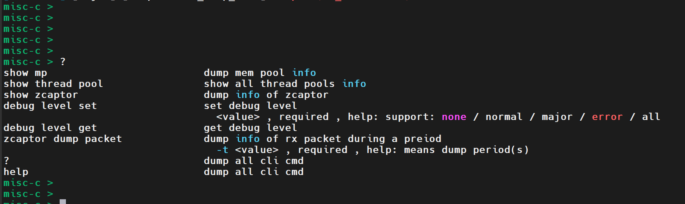
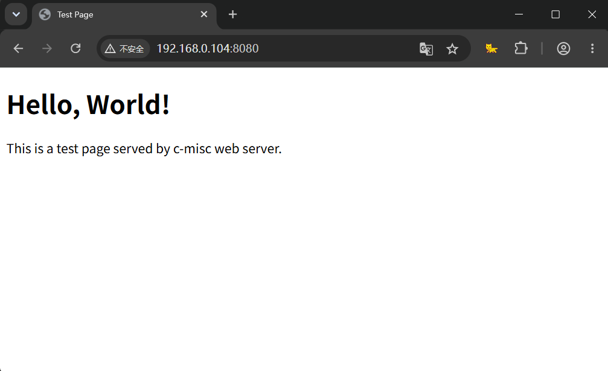

# MISC-C

[](https://github.com/iammcai/misc-c/stargazers)
[](https://github.com/iammcai/misc-c/forks)
[](https://github.com/iammcai/misc-c/commits)
[](https://en.wikipedia.org/wiki/C_(programming_language))
[](https://cmake.org/)

> 🚀 一套高性能、可复用的 C 语言基础设施组件库，用于个人学习与能力提升。

项目同步更新于个人公众号 **codeFishh**，欢迎关注 & Star ⭐

---

## 📋 目录

- [项目简介](#-项目简介)
- [组件列表](#-组件列表)
  - [数据结构](#数据结构)
  - [组件](#组件)
  - [管理组件](#管理组件)
  - [应用组件](#应用组件)
- [快速开始](#-快速开始)
- [构建](#-构建)
- [性能对比](#-性能对比)

---

## 📖 项目简介

**MISC-C** 是一个专注于**高性能**和**低开销**的 C 语言基础设施组件库。核心设计理念包括：

- **侵入式数据结构**：将结构体嵌入用户数据，减少内存分配与指针间接访问开销
- **无锁/低锁并发**：原子操作 + 无锁队列 + 轻量锁，规避传统互斥锁带来的性能瓶颈
- **用户态优化**：用户态定时器规避系统调用开销，适用于高频超时场景
- **基于组件实现管理APP**：支持CLI、Web管理





---

## 🧩 组件列表

### 数据结构

| 组件 | 描述 | 状态 |
|------|------|------|
| **侵入式链表** | 性能优于非侵入式链表 | ✅ 完成 |
| **侵入式哈希表** | 性能优于非侵入式哈希 | ✅ 完成 |
| **侵入式原子 SPSC 队列** | 单生产者单消费者无锁队列，性能优于 mutex + 队列 | ✅ 完成 |
| **原子 MPMC 队列** | 多生产者多消费者无锁队列，已解决 ABA 问题 | 待解决Use-After-Free问题 |
| **侵入式堆** | 用于优先队列等场景 | ✅ 完成 |
| **侵入式跳表** | 有序数据结构，支持快速查找 | ✅ 完成 |

### 组件

| 组件 | 描述 | 状态 |
|------|------|------|
| **事件驱动线程框架** | 基于事件循环的线程模型 | ✅ 完成 |
| **用户态锁框架** | 支持自动加锁/解锁，实现自旋锁、读写锁，性能优于 `pthread_mutex` | ✅ 完成 |
| **内存池** | 支持跨线程收发，性能优于 `calloc`/`free` | ✅ 完成 |
| **消息队列** | 支持多发送者单接收者模型 | ✅ 完成 |
| **线程池** | 复用线程，降低创建销毁开销，提升任务响应速度 | ✅ 完成 |
| **高精度定时器** | 基于 `timerfd` + `epoll` 实现 | ✅ 完成 |
| **用户态定时器** | 规避系统调用和内核上下文切换，适用于高频超时场景 | ✅ 完成 |
| **Reactor事件调度器** | 将系统中的fd集中管理，事件统一调度。目前集中了fd事件 | ✅ 完成 |
| **syslog日志库** | 简易本地日志库 | ✅ 完成 |

### 管理组件

| 组件 | 描述 | 状态 |
|------|------|------|
| **简易 CLI 服务** | 基于GUN Readline，自行实现前缀树（Trie）存储命令，支持参数解析、自动补全、历史记录 | ✅ 完成 |
| **简易 WEB 服务** | 实现简单的web服务器，使用端口`8080` | 待完善 |

### 应用组件

| 组件 | 描述 | 状态 |
|------|------|------|
| **零拷贝抓包模块** | 底层使用 socket + ring_buffer + mmap + epoll | ✅ 完成 |
| **发包模块** | 支持主动发送报文 | 目前支持RAW_SOCKET自定义发包 |
|**ARP探测**|基于收发模块，实现ARP探测，通过ip获取mac|✅完成|
|**PING**|基于收发模块，实现PING工具|✅完成|

---

## 🤔 TODOLIST

---

## 🚀 快速开始

### 依赖

- C 编译器（支持 C11 及以上）
- CMake 3.10+
- CLI框架依赖GUN Readline，需要安装

```bash
sudo apt install libreadline-dev
```

### 构建

```bash
git clone https://github.com/iammcai/misc-c.git
cd misc-c
mkdir build && cd build
cmake ..
make
```

### 运行测试

```bash
sudo ./Main
```

---

## 📊 性能对比

| 组件 | 对比对象 | 性能优势 |
|------|----------|----------|
| 侵入式链表 | 非侵入式链表 | 更少内存分配，更高缓存友好性 |
| 用户态自旋锁 | `pthread_mutex` | 更低锁开销 |
| 内存池 | `calloc`/`free` | 更快分配/释放，减少内存碎片 |
| 用户态定时器 | `timerfd` 方案 | 规避系统调用，适用于高频场景 |

> 📌 具体性能数据请参考 `test/` 目录下的基准测试代码。

---

## 🙏 致谢

感谢所有关注本项目的开发者，欢迎提交 Issue 和 PR！

---

**📮 联系 & 关注**

- 公众号：codeFishh
- GitHub：[iammcai](https://github.com/iammcai)
- E-Mail：sybstudy@yeah.net