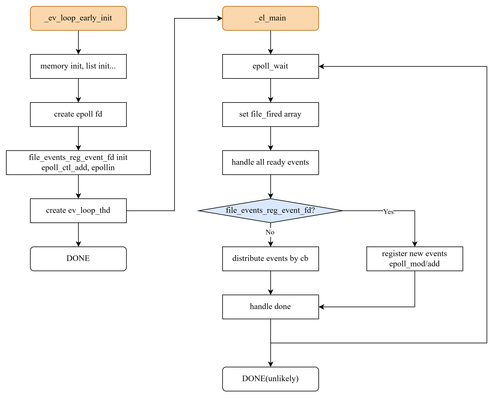

# event loop

一开始是想把项目中所有的epoll+fd都统一到一个模块进行管理，一番了解下得知这是一种主流的设计，名为reactor

## 架构设计

事件调度管理重要的数据结构定义如下。其中重点关注`el_t`：

- `epoll_fd`：将所有的fd注册到这个epoll进行管理
- `file_events`：数组，存放所有注册进来的fd，数组下标即为fd，内部记录注册掩码、事件触发回调函数及参数。考虑到本项目使用的fd少，且比较紧凑，所以不适用hashtable
- `file_fireds`：数组，存放每次事件处理时的快照，避免例如一轮中处理fdA和fdB，而fdA处理中注销了fdB，直接操作`file_events`可能出问题的情况
- `file_events_reg_list`：一个侵入式链表，存放系统运行时动态注册fd到ev_loop中的信息
- `file_events_reg_spinlock`：用来保护上述链表
- `file_events_reg_event_fd`：一个eventfd，初始化注册到epoll中，当外部注册事件时，通过这个fd来唤醒ev_loop进行注册处理
- `ev_loop_th`：ev_loop运行的子线程ID
- `events`：ev_loop主循环使用的就绪事件缓冲区，放在这里，避免在接口中重复使用栈内存

```C
// file快照结构定义
typedef struct{
    int fd;                 // 就绪fd
    unsigned char mask;     // 事件类型mask
}el_file_event_fired_t;

// file事件结构定义
typedef struct{
    unsigned char mask;         // 掩码，表示监听读写事件，见el_file_event_mask_e
    el_file_event_cb read_cb;   // 可读事件回调
    el_file_event_cb write_cb;  // 可写事件回调
    void *args;                 // 回调参数
}el_file_event_t;

// 事件循环管理结构定义
typedef struct el_s{
    int epoll_fd;               // epoll fd

    el_file_event_t *file_events;           // 存储file事件的数组，以fd为下标。为了性能，不使用哈希表
    el_file_event_fired_t *file_fireds;     // file_events运行时快照，防止多个fd互相操作破坏结构

    el_fe_reg_list_head_t file_events_reg_list;     // 用于运行时修改事件的链表
    ev_spinlock_t file_events_reg_spinlock;         // 保护file_events_reg_list
    int file_events_reg_event_fd;                   // eventfd，用于唤醒处理注册

    pthread_t ev_loop_th;       // 进行loop的线程id
    #define EV_LOOP_FILE_EVENT_COUNT_MAX    (512)               // 支持的file事件最大数量
    struct epoll_event events[EV_LOOP_FILE_EVENT_COUNT_MAX];    // 事件缓冲区
}el_t;
```

整个运行逻辑如下图



