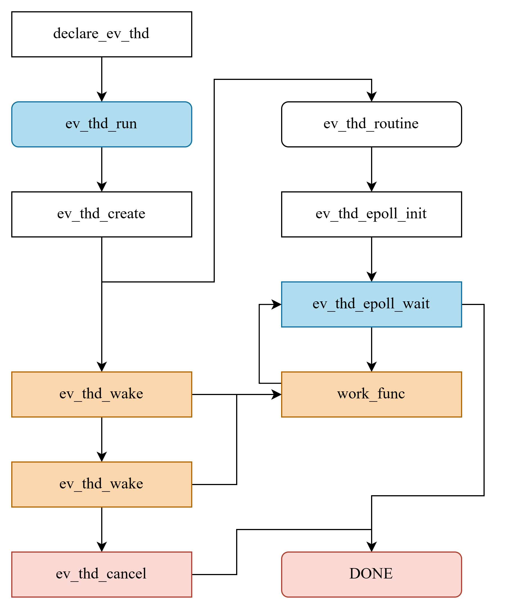

# event thread

所谓事件驱动线程，指的是线程平时暂停运行，等待指定事件出现时，再处理对应工作

## 架构设计

每个线程对应一个`ev_thd_attr_t`类型变量，其中记录着线程相关属性，例如线程ID、运行状态、工作函数以及各种钩子函数

```C
// 线程属性定义
typedef struct{
    const char *name;       // 属性名
    pthread_t tid;          // 线程ID
    int epoll_fd;           // epoll fd
    int event_fd;           // 用于唤醒线程的event fd

    char run;           // 启动标志
    char working;       // 工作标志

    ev_thd_hook_list_head_t ctors;      // ctor函数链表
    ev_thd_hook_list_head_t preworks;   // prework函数链表
    ev_thd_work_func work;              // 工作函数
    void *args;                         // 工作函数入参
    ev_thd_hook_list_head_t postworks;  // postwork函数链表
    ev_thd_hook_list_head_t dtors;      // dtor函数链表

    ev_thd_attr_hash_item_t item;   // 哈希表item
}ev_thd_attr_t;
```

所有`ev_thd_attr_t`类型变量使用一个全局哈希表存储起来，统一管理

## 线程运行模型

线程的运行如图所示

1. 通过`declare_ev_thd`定义一个线程属性
2. 通过`ev_thd_run`启动线程，内部会调用`pthread_create`创建线程，并创建`epoll`监听`event_fd`可读事件，阻塞等待唤醒
3. 通过`ev_thd_wake`唤醒线程，内部会写`event_fd`以唤醒一次线程
4. 通过`ev_thd_cancel`结束线程，内部会结束线程，并回收资源



此外线程支持注册四类钩子函数，分别是：

- `ctor`：在`ev_thd_run`时先调用，再创建线程
- `dtor`：线程结束后，调用
- `prework`：每次唤醒线程时先调用，再执行work函数
- `postwork`：每次唤醒线程，执行work函数后，调用