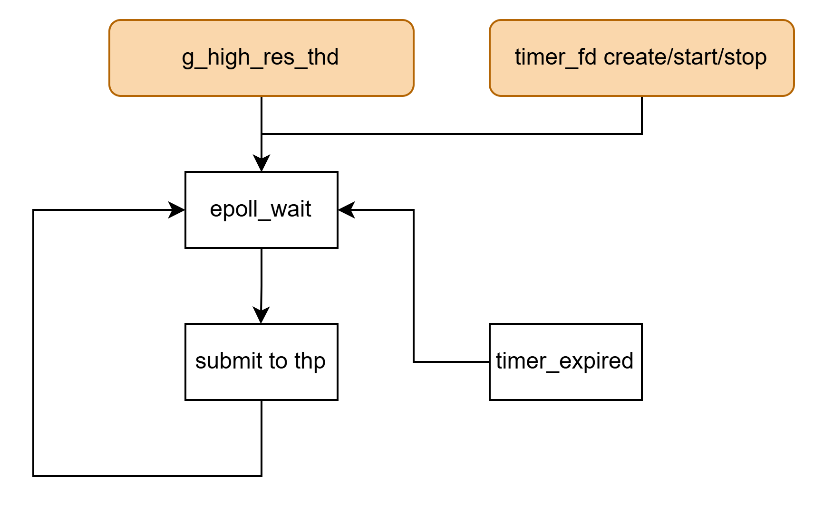
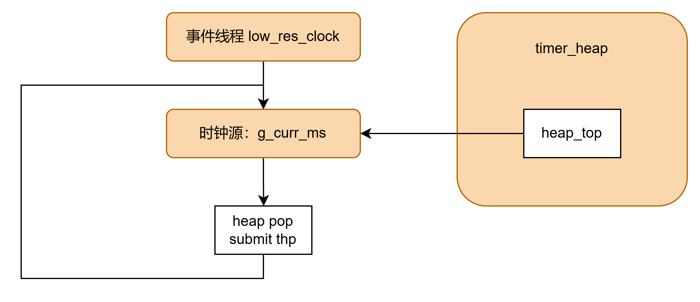

# event timer

本目录实现一个用户态的定时器，同时提供高精度的定时器

## 设计思路

### 高精度定时器

高精度定时器使用timer_fd，依赖内核定时器hrtimer，timer_fd提供了通过fd管理定时器的手段，我们使用epoll来进行管理

设计上，包含一个全局的epoll来监听所有创建的timerfd，使用一个单独的线程来监听epoll事件

- 创建定时器：创建一个timer_fd，时间参数设置全0，并加入epoll监听EPOLLIN
- 启动定时器：设置时间参数，选择单次启动
- 结束定时器：设置时间参数全0

### 用户态定时器

用户态定时器主要是为了做到管理海量的定时器，和timer_fd相比优势如下：

- 减少epoll唤醒次数
- 减少syscall和内核对象分配

当然也存在劣势

- 精度受限为100ms
- 空闲时仍存在100ms唤醒一次空扫描
- 需要手动管理锁等

整体架构如下：

- 全局变量`g_curr_ms`作为低精度时钟源
- 用户创建启动的定时器，放到全局堆`g_ev_timer_heap`中，排序的依据是超时的绝对时间。确保堆顶是最早到期的定时器
    - 结束的定时器，设置`deleted`标志，后续到期弹出后不执行回调
- 事件线程`low_res_clock`每100ms唤醒一次，做以下工作：
    - 更新时钟源
    - 循环检查堆顶，如果到期，那么弹出来，并发给线程池执行回调