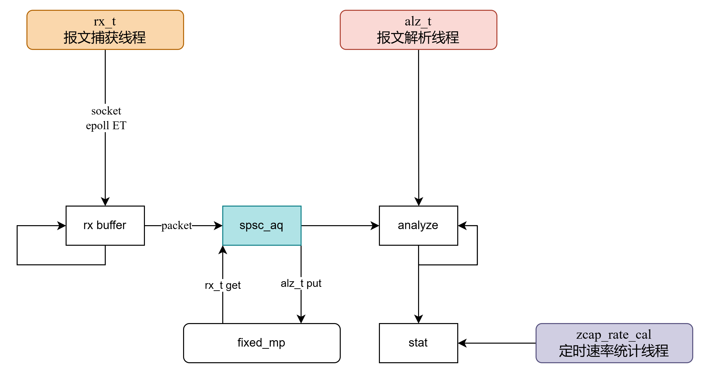
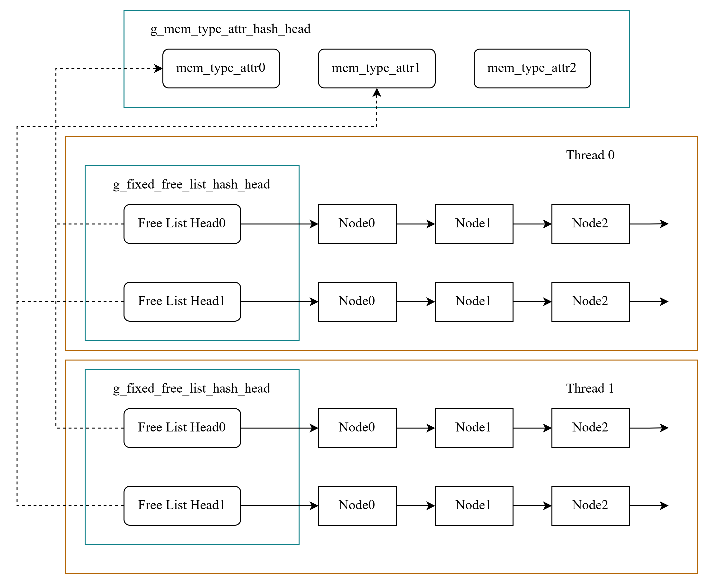
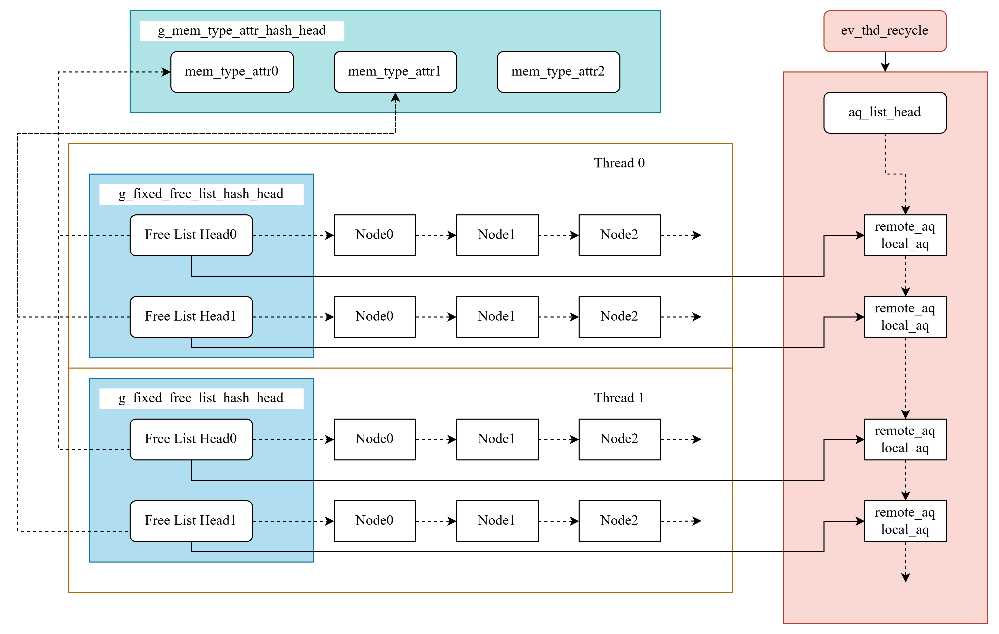

# mem pool

## 架构设计

### 内存类型

首先是一个全局的内存类型属性`mem_type_attr_t`，使用一个全局哈希表`g_mem_type_attr_hash_head`来存储所有类型。

```C
// 内存类型属性
typedef struct{
    const char *name;                   // 类型名
    unsigned int flag;                  // 标志位
    unsigned int node_size;             // 该类型的内存节点大小
    unsigned int node_max_num;          // 该类型的最大节点数量
    mem_type_attr_hash_item_t item;     // hash item
}mem_type_attr_t;
```

定义构造函数`g_mem_type_attr_hash_init`来确保进入`main`函数前初始化

用户需要声明一个业务对应的内存类型，后续使用这个类型来进行内存申请和释放

### 固定大小内存池

接着定义固定大小的内存节点类型`fixed_mem_node_t`，其中使用柔性数组来存给用户的真正内存

```C
// 固定大小内存节点定义
typedef struct{
    mem_type_attr_t *attr;                  // 所属内存类型
    fixed_mem_node_free_list_item_t item;   // free list item
    unsigned int size;                      // 用户内存大小
    char attr_aligned(8) data[];            // 柔性数组，真正给用户使用的内存区
} attr_aligned(8) fixed_mem_node_t;
```

使用一个单链表free_list来存储所有内存节点，用户申请时从链表头获取，释放时也放回链表头

所有的空闲单链表头加入一个全局哈希表

```C
// 固定大小空闲内存链表头定义，哈希表存储起来
typedef struct{
    fixed_free_list_head_t  *head;  // 空闲链表头
    mem_type_attr_t *attr;          // 所属内存类型
    fixed_free_list_head_hash_item_t item;  // item
}fixed_free_list_t;
```

整体的结构如图：



#### 无锁化

以上实现的内存池是线程不安全的，并发使用需要外部使用锁

加解锁是耗时操作，针对此，考虑使用空间换时间的方式来无锁化

具体而言，使用`thread_local`属性来修饰全局空闲链表，所有的线程各自持有一份“副本”。从内存的视角看，每个线程在内存中都有一份copy

```C
// 全局哈希表，存储所有固定大小空闲链表头。使用线程私有属性，每个线程持有一个同名的副本，互不干扰，做到隔离
static thread_local fixed_free_list_head_hash_head_t g_fixed_free_list_hash_head = {};
```

`mp_fixed_init`宏中对其进行了初始化，具体可见相关实现

多线程视角下，整体的结构如图：



#### 跨线程分配释放

以上实现了线程独立内存池，每个线程持有各自的空闲内存，在同一线程内部可以独立进行分配、释放。

但是，实际业务中往往涉及到跨线程的分配释放

例如有一个抓包线程A，必须快速执行以免丢包，分配了一块内存丢入消息队列后继续执行。处理线程B拿到消息，进行处理，完成后需要释放。B并不知道A的内存池信息，没法直接将内存结点插回到A的空闲链表中。

这一部分设计就是为了解决以上描述的场景。考虑做如下的设计：

- `fixed_mem_node_t`添加一个`tid`属性，表示内存是从哪个线程分配来的
- 添加线程独立的两个队列，存放`fixed_mem_node_t`内存节点，队列中存放待释放回空闲链表的内存节点
    - 队列定义在`fixed_cycle_aq_t`类型中，其中包含两个原子队列head
    - local队列：存放需要本线程回收的节点
    - remote队列：存放需要其它线程回收的节点
- 所有队列，记录到一个全局链表`g_fixed_cycle_aq_list_head`中
- 回收队列使用原子SPSC队列，减少锁带来的开销
- 添加一个后台线程，他会遍历队列，将remote队列中的节点，放到对应的local队列中，由此实现跨线程回收
    - 线程每1000ms自行唤醒一次；某个线程remote队列长度超过阈值128后，立即唤醒一次
- 分配内存前，先将local队列中的内存移回到空闲链表

#### 最终的设计



#### 使用方式

固定大小内存：

1. `declare_mem_type_fixed`，全局定义内存类型
2. 线程内部`mp_fixed_init`初始化内存池，此时还没有申请内存节点。可选，目前已支持懒初始化
3. `mp_fixed_supply`申请线程内存节点，线程需要分配的话就要调用。可选，目前已支持懒加载
4. `mp_fixed_node_get`：申请内存
5. `mp_fixed_node_put`：归还内存

### 非固定大小内存池

非固定大小内存池的架构设计与固定大小的类似，都是线程隔离，后台线程帮助跨线程回收。主要区别在于：

1. 空闲节点组织使用跳表，以在分配内存时精准查找最合适的内存节点（Best Fit）
2. 初始分配一个大块内存，分配时如果最合适的节点大小远大于所需的内存（设置一个阈值），那么进行分割

#### 申请内存

初始从系统申请4MB的chunk，然后在头部初始化一个内存头，加入跳表

用户传入需求的size，向上按8B取整，以便后续分割节点。

分配的时候，按照Best Fit原则找到节点。尝试进行以下分割，如果`New Node Data`大于阈值64B，那么就进行分割，把`New Node`加回到跳表

```
|         Node          |           New Node            |
|-----------------------|-------------------------------|
| Node Head | User Data | New Node Head | New Node Data |
```

#### 归还内存

归还内存也是，本地申请的内存，直接加回到跳表，否则加入remote_recycle_aq等待回收

#### 内存合并

## 测试

测试分配释放256*512B的内存，对比`calloc`和`free`

线程1分配，分配后加到消息队列让线程2释放：

```bash
cai@raspberrypi:~/share/misc-c/build $ ./Main
mp_fixed_node_get 256 nodes cost 474 us, average 1.852 us/node
mp_fixed_node_put 256 nodes cost 466 us, average 1.820 us/node
calloc 256 nodes cost 618 us, average 2.414 us/node
free 256 nodes cost 641 us, average 2.504 us/node
cai@raspberrypi:~/share/misc-c/build $ ./Main
mp_fixed_node_get 256 nodes cost 241 us, average 0.941 us/node
mp_fixed_node_put 256 nodes cost 234 us, average 0.914 us/node
calloc 256 nodes cost 1082 us, average 4.227 us/node
free 256 nodes cost 1009 us, average 3.941 us/node
cai@raspberrypi:~/share/misc-c/build $ ./Main
mp_fixed_node_get 256 nodes cost 262 us, average 1.023 us/node
mp_fixed_node_put 256 nodes cost 256 us, average 1.000 us/node
calloc 256 nodes cost 407 us, average 1.590 us/node
free 256 nodes cost 367 us, average 1.434 us/node
cai@raspberrypi:~/share/misc-c/build $ ./Main
mp_fixed_node_get 256 nodes cost 244 us, average 0.953 us/node
mp_fixed_node_put 256 nodes cost 236 us, average 0.922 us/node
calloc 256 nodes cost 549 us, average 2.145 us/node
free 256 nodes cost 574 us, average 2.242 us/node
cai@raspberrypi:~/share/misc-c/build $ ./Main
mp_fixed_node_get 256 nodes cost 474 us, average 1.852 us/node
mp_fixed_node_put 256 nodes cost 460 us, average 1.797 us/node
calloc 256 nodes cost 912 us, average 3.562 us/node
free 256 nodes cost 904 us, average 3.531 us/node
```

## 调试方案

在支持cli后，通过`show mp`查看通过`mp_xxx`分配的信息，原则上向系统申请的内存，都需要走这个接口

```bash
misc-c > show mp

********************************
alloc count: 579, size: 1079536B
free  count: 36, size: 4838B
current used: 1074698 B, 1049.510 KB
********************************

```

另外，代码中添加一个`MP_DETAIL_DUMP`宏，开启时添加一些dbg打印，主要用来收集运行时数据。平时关闭，避免影响申请/释放速度

## 更新日志

- 2026-07-11：添加自动初始化内存池，调用方无需手动调用`mp_fixed_init`以及`mp_fixed_supply`