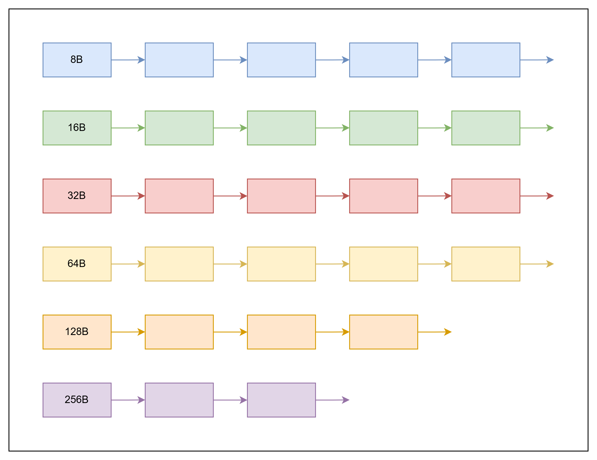

# MP Slab

按照fixed mp的思路实现的nonfixed mp，使用跳表存储节点，实际测试发现性能比系统的malloc/free差了好几个量级，需要进行优化

优化的总体思路在于规避跳表O(log N)的查找性能，改用多级链表来做到O(1)，具体思路如下

## 设计思路

分级内存池的架构如下：



1. 内存池由多个分级链表组成，每个节点为一块空闲内存
2. 每个链表中内存的大小是固定的，用户申请内存池，根据大小可以O(1)找到适合的内存节点
3. 线程独立的设计同mp.c

---

## 优化记录

初版测试加速比只有0.3x，性能差距太大

仅运行`malloc`和`free`

```
cai@raspicai:~/share/misc-c/build $ sudo perf stat -e cycles,instructions,cache-references,cache-misses,L1-dcache-load-misses ./Main

========== Memory Pool (SLAB) Performance Test ==========
    SYS: 1010904.620 us, 49.461 ops/us
==================================================

 Performance counter stats for './Main':

     2,633,213,541      cycles
     8,670,686,810      instructions                     #    3.29  insn per cycle
     3,171,185,002      cache-references
           694,059      cache-misses                     #    0.02% of all cache refs
           694,059      L1-dcache-load-misses

       1.224032316 seconds time elapsed

       1.026729000 seconds user
       0.073047000 seconds sys
```

仅运行slab

```
cai@raspicai:~/share/misc-c/build $ sudo perf stat -e cycles,instructions,cache-references,cache-misses,L1-dcache-load-misses ./Main

========== Memory Pool (SLAB) Performance Test ==========
[1] Alloc + Free, Ping-Pong
    MP: 2871596.676 us, 17.412 ops/us
==================================================

 Performance counter stats for './Main':

     7,044,381,198      cycles
    11,724,304,720      instructions                     #    1.66  insn per cycle
     6,169,122,470      cache-references
         1,507,871      cache-misses                     #    0.02% of all cache refs
         1,507,871      L1-dcache-load-misses

       3.104032728 seconds time elapsed

       2.880376000 seconds user
       0.088256000 seconds sys
```

通过调用栈分析热点函数：

```
cai@raspicai:~/share/misc-c/build $ sudo perf record -g --call-graph fp ./Main

========== Memory Pool (SLAB) Performance Test ==========
[1] Alloc + Free, Ping-Pong
    MP: 2913231.544 us, 17.163 ops/us
==================================================
[ perf record: Woken up 7 times to write data ]
[ perf record: Captured and wrote 1.531 MB perf.data (12096 samples) ]
cai@raspicai:~/share/misc-c/build $
cai@raspicai:~/share/misc-c/build $
cai@raspicai:~/share/misc-c/build $ sudo perf report --stdio --sort=symbol,dso --percent-limit=1
# To display the perf.data header info, please use --header/--header-only options.
#
#
# Total Lost Samples: 0
#
# Samples: 12K of event 'cycles:P'
# Event count (approx.): 7179299322
#
# Children      Self  Symbol                                Shared Object          IPC   [IPC Coverage]
# ........  ........  ....................................  .....................  ....................
#
    99.98%     0.00%  [.] _start                            Main                   -      -
            |
            ---__libc_start_main
               |
               |--97.18%--0x7ffeffbc225c
               |          main
               |          test_slab_mp_cost
               |          |
               |           --97.03%--_test_single_mp_get
               |                     |
               |                     |--50.84%--_mp_slab_node_get
               |                     |          |
               |                     |           --20.03%--type_list_pop
               |                     |
               |                      --40.68%--_mp_slab_node_put
               |                                |
               |                                 --14.11%--type_list_add_head
               |
               |--1.40%--eth0_zcap_init
               |          _zcap_init
               |          |
               |           --1.40%--_zcap_ring_init
               |                     |
               |                      --1.33%--setsockopt
               |                                el0t_64_sync
               |                                el0t_64_sync_handler
               |                                el0_svc
               |                                do_el0_svc
               |                                el0_svc_common.constprop.0
               |                                invoke_syscall
               |                                __arm64_sys_setsockopt
               |                                __sys_setsockopt
               |                                do_sock_setsockopt
               |                                packet_setsockopt
               |                                packet_set_ring
               |                                get_free_pages_noprof
               |                                alloc_pages_noprof
               |                                alloc_frozen_pages_noprof
               |                                alloc_pages_mpol
               |                                __alloc_frozen_pages_noprof
               |                                |
               |                                 --1.32%--__pi_clear_page
               |
                --1.38%--wlan0_zcap_init
                          _zcap_init
                          _zcap_ring_init
                          |
                           --1.32%--setsockopt
                                     el0t_64_sync
                                     el0t_64_sync_handler
                                     el0_svc
                                     do_el0_svc
                                     el0_svc_common.constprop.0
                                     invoke_syscall
                                     __arm64_sys_setsockopt
                                     __sys_setsockopt
                                     do_sock_setsockopt
                                     packet_setsockopt
                                     packet_set_ring
                                     get_free_pages_noprof
                                     alloc_pages_noprof
                                     alloc_frozen_pages_noprof
                                     alloc_pages_mpol
                                     __alloc_frozen_pages_noprof
                                     __pi_clear_page

    99.98%     0.00%  [.] __libc_start_main                 libc.so.6              -      -
            |
            |--97.18%--0x7ffeffbc225c
            |          main
            |          test_slab_mp_cost
            |          |
            |           --97.03%--_test_single_mp_get
            |                     |
            |                     |--50.84%--_mp_slab_node_get
            |                     |          |
            |                     |           --20.03%--type_list_pop
            |                     |
            |                      --40.68%--_mp_slab_node_put
            |                                |
            |                                 --14.11%--type_list_add_head
```

对应解决方案是自己实现一个栈来管理，解决完后热点消失，性能有所提升

```
cai@raspicai:~/share/misc-c/build $ sudo ./Main

========== Memory Pool (SLAB) Performance Test ==========
[1] Alloc + Free, Ping-Pong
    MP: 2159204.596 us, 23.157 ops/us
    SYS: 1007352.692 us, 49.635 ops/us
    Speedup: 0.467 x
==================================================
```

通过`annotate`来查看指令级的开销


```
cai@raspicai:~/share/misc-c/build $ sudo perf annotate _mp_slab_node_get --stdio --percent-limit=3
 Percent |      Source code & Disassembly of Main for cycles:P (4515 samples, percent: local period)
----------------------------------------------------------------------------------------------------
         :
         :
         :
         : 3     Disassembly of section .text:
         :
         : 5     00000000000137f8 <_mp_slab_node_get>:
         :
         : 7     return mp;
         : 8     }
         :
         : 10    void* _mp_slab_node_get(mem_type_attr_t *attr, int size)
         : 11    {
    0.07 :   137f8:  stp     x29, x30, [sp, #-432]!
    0.00 :   137fc:  mov     x29, sp
    0.00 :   13800:  str     x0, [sp, #24]
    1.77 :   13804:  str     w1, [sp, #20]
    0.07 :   13808:  ldr     x0, [sp, #24]
    0.04 :   1380c:  str     x0, [sp, #360]
    0.31 :   13810:  mov     w0, #0x1                        // #1
    0.04 :   13814:  str     w0, [sp, #356]
         : 20    if(likely(attr == attr_cache))
    0.00 :   13818:  mrs     x0, tpidr_el0
    0.00 :   1381c:  add     x0, x0, #0x0, lsl #12
    0.00 :   13820:  add     x0, x0, #0x68
    1.73 :   13824:  ldr     x0, [x0]
    0.27 :   13828:  ldr     x1, [sp, #360]
    0.11 :   1382c:  cmp     x1, x0
    0.20 :   13830:  cset    w0, eq  // eq = none
    0.04 :   13834:  and     w0, w0, #0xff
    0.00 :   13838:  and     x0, x0, #0xff
    0.00 :   1383c:  cmp     x0, #0x0
    0.00 :   13840:  b.eq    13858 <_mp_slab_node_get+0x60>  // b.none
         : 32    return slab_mp_cache;
    4.67 :   13844:  mrs     x0, tpidr_el0
    0.00 :   13848:  add     x0, x0, #0x0, lsl #12
    0.00 :   1384c:  add     x0, x0, #0x70
    0.07 :   13850:  ldr     x0, [x0]
    0.13 :   13854:  b       13ad0 <_mp_slab_node_get+0x2d8>
         : 38    if(unlikely(!g_slab_mp_hash_init_flag))
    0.00 :   13858:  mrs     x0, tpidr_el0
    0.00 :   1385c:  add     x0, x0, #0x0, lsl #12
    0.00 :   13860:  add     x0, x0, #0x60
    0.00 :   13864:  ldrb    w0, [x0]
    0.00 :   13868:  cmp     w0, #0x0
    0.00 :   1386c:  cset    w0, eq  // eq = none
    0.00 :   13870:  and     w0, w0, #0xff
    0.00 :   13874:  and     x0, x0, #0xff
    0.00 :   13878:  cmp     x0, #0x0
    0.00 :   1387c:  b.eq    138e0 <_mp_slab_node_get+0xe8>  // b.none
    0.00 :   13880:  mrs     x0, tpidr_el0
    0.00 :   13884:  add     x0, x0, #0x0, lsl #12
    0.00 :   13888:  add     x0, x0, #0x50
    0.00 :   1388c:  str     x0, [sp, #344]
         : 53    declare_hash(slab_mp, slab_mp, slab_mp_t, item, 1, 31, _slab_mp_cmp, _slab_mp_hash)
    0.00 :   13890:  ldr     x0, [sp, #344]
    0.00 :   13894:  cmp     x0, #0x0
    0.00 :   13898:  b.ne    138bc <_mp_slab_node_get+0xc4>  // b.any
    0.00 :   1389c:  adrp    x0, 28000 <__PRETTY_FUNCTION__.17>
    0.00 :   138a0:  add     x3, x0, #0x110
    0.00 :   138a4:  mov     w2, #0xa5                       // #165
    0.00 :   138a8:  adrp    x0, 27000 <__PRETTY_FUNCTION__.0+0x188>
    0.00 :   138ac:  add     x1, x0, #0xed0
    0.00 :   138b0:  adrp    x0, 27000 <__PRETTY_FUNCTION__.0+0x188>
    0.00 :   138b4:  add     x0, x0, #0xf20
    0.00 :   138b8:  bl      2ec0 <__assert_fail@plt>
    0.00 :   138bc:  ldr     x0, [sp, #344]
    0.00 :   138c0:  mov     w2, #0x1f                       // #31
    0.00 :   138c4:  mov     w1, #0x1                        // #1
    0.00 :   138c8:  bl      85bc <type_hash_init>
         : 69    g_slab_mp_hash_init_flag = 1;
    0.00 :   138cc:  mrs     x0, tpidr_el0
    0.00 :   138d0:  add     x0, x0, #0x0, lsl #12
    0.00 :   138d4:  add     x0, x0, #0x60
    0.00 :   138d8:  mov     w1, #0x1                        // #1
    0.00 :   138dc:  strb    w1, [x0]
         : 75    slab_mp_t key = {.attr = attr};
    0.00 :   138e0:  add     x0, sp, #0x20
    0.00 :   138e4:  movi    v31.4s, #0x0
    0.00 :   138e8:  str     q31, [x0]
    0.00 :   138ec:  str     q31, [x0, #16]
    0.00 :   138f0:  str     q31, [x0, #32]
    0.00 :   138f4:  str     q31, [x0, #48]
    0.00 :   138f8:  str     q31, [x0, #64]
    0.00 :   138fc:  str     q31, [x0, #80]
    0.00 :   13900:  str     q31, [x0, #96]
    0.00 :   13904:  str     q31, [x0, #112]
    0.00 :   13908:  str     q31, [x0, #128]
    0.00 :   1390c:  str     q31, [x0, #144]
    0.00 :   13910:  str     q31, [x0, #160]
    0.00 :   13914:  fmov    x1, d31
    0.00 :   13918:  str     x1, [x0, #176]
    0.00 :   1391c:  ldr     x0, [sp, #360]
    0.00 :   13920:  str     x0, [sp, #32]
    0.00 :   13924:  mrs     x0, tpidr_el0
    0.00 :   13928:  add     x0, x0, #0x0, lsl #12
    0.00 :   1392c:  add     x0, x0, #0x50
    0.00 :   13930:  str     x0, [sp, #336]
    0.00 :   13934:  add     x0, sp, #0x20
    0.00 :   13938:  str     x0, [sp, #328]
         : 99    declare_hash(slab_mp, slab_mp, slab_mp_t, item, 1, 31, _slab_mp_cmp, _slab_mp_hash)
    0.00 :   1393c:  ldr     x0, [sp, #336]
    0.00 :   13940:  cmp     x0, #0x0
    0.00 :   13944:  b.eq    13954 <_mp_slab_node_get+0x15c>  // b.none
    0.00 :   13948:  ldr     x0, [sp, #328]
    0.00 :   1394c:  cmp     x0, #0x0
    0.00 :   13950:  b.ne    13974 <_mp_slab_node_get+0x17c>  // b.any
    0.00 :   13954:  adrp    x0, 28000 <__PRETTY_FUNCTION__.17>
    0.00 :   13958:  add     x3, x0, #0x128
    0.00 :   1395c:  mov     w2, #0xa5                       // #165
    0.00 :   13960:  adrp    x0, 27000 <__PRETTY_FUNCTION__.0+0x188>
    0.00 :   13964:  add     x1, x0, #0xed0
    0.00 :   13968:  adrp    x0, 27000 <__PRETTY_FUNCTION__.0+0x188>
    0.00 :   1396c:  add     x0, x0, #0xf70
    0.00 :   13970:  bl      2ec0 <__assert_fail@plt>
    0.00 :   13974:  str     xzr, [sp, #320]
    0.00 :   13978:  ldr     x4, [sp, #336]
    0.00 :   1397c:  ldr     x0, [sp, #328]
    0.00 :   13980:  add     x1, x0, #0xa8
    0.00 :   13984:  adrp    x0, 12000 <mp_dump_fixed_free_list+0x334>
    0.00 :   13988:  add     x3, x0, #0x7a8
    0.00 :   1398c:  adrp    x0, 12000 <mp_dump_fixed_free_list+0x334>
    0.00 :   13990:  add     x2, x0, #0x70c
    0.00 :   13994:  mov     x0, x4
    0.00 :   13998:  bl      8ffc <type_hash_find>
    0.00 :   1399c:  str     x0, [sp, #320]
    0.00 :   139a0:  ldr     x0, [sp, #320]
    0.00 :   139a4:  cmp     x0, #0x0
    0.00 :   139a8:  b.eq    139c0 <_mp_slab_node_get+0x1c8>  // b.none
    0.00 :   139ac:  ldr     x0, [sp, #320]
    0.00 :   139b0:  str     x0, [sp, #312]
    0.00 :   139b4:  ldr     x0, [sp, #312]
    0.00 :   139b8:  sub     x0, x0, #0xa8
    0.00 :   139bc:  b       139c4 <_mp_slab_node_get+0x1cc>
    0.00 :   139c0:  mov     x0, #0x0                        // #0
         : 134   slab_mp_t *mp = slab_mp_hash_find(&g_slab_mp_hash, &key);
    0.00 :   139c4:  str     x0, [sp, #304]
         : 136   if(unlikely(!mp))
    0.00 :   139c8:  ldr     x0, [sp, #304]
    0.00 :   139cc:  cmp     x0, #0x0
    0.00 :   139d0:  cset    w0, eq  // eq = none
    0.00 :   139d4:  and     w0, w0, #0xff
    0.00 :   139d8:  and     x0, x0, #0xff
    0.00 :   139dc:  cmp     x0, #0x0
    0.00 :   139e0:  b.eq    13aa4 <_mp_slab_node_get+0x2ac>  // b.none
         : 144   _mp_slab_init(attr);        // 初始化
    0.00 :   139e4:  ldr     x0, [sp, #360]
    0.00 :   139e8:  bl      12e6c <_mp_slab_init>
         : 147   if(supply)                  // 补充内存
    0.00 :   139ec:  ldr     w0, [sp, #356]
    0.00 :   139f0:  cmp     w0, #0x0
    0.00 :   139f4:  b.eq    13a00 <_mp_slab_node_get+0x208>  // b.none
         : 151   _mp_slab_supply(attr);
    0.00 :   139f8:  ldr     x0, [sp, #360]
    0.00 :   139fc:  bl      13538 <_mp_slab_supply>
    0.00 :   13a00:  mrs     x0, tpidr_el0
    0.00 :   13a04:  add     x0, x0, #0x0, lsl #12
    0.00 :   13a08:  add     x0, x0, #0x50
    0.00 :   13a0c:  str     x0, [sp, #296]
    0.00 :   13a10:  add     x0, sp, #0x20
    0.00 :   13a14:  str     x0, [sp, #288]
         : 160   declare_hash(slab_mp, slab_mp, slab_mp_t, item, 1, 31, _slab_mp_cmp, _slab_mp_hash)
    0.00 :   13a18:  ldr     x0, [sp, #296]
    0.00 :   13a1c:  cmp     x0, #0x0
    0.00 :   13a20:  b.eq    13a30 <_mp_slab_node_get+0x238>  // b.none
    0.00 :   13a24:  ldr     x0, [sp, #288]
    0.00 :   13a28:  cmp     x0, #0x0
    0.00 :   13a2c:  b.ne    13a50 <_mp_slab_node_get+0x258>  // b.any
    0.00 :   13a30:  adrp    x0, 28000 <__PRETTY_FUNCTION__.17>
    0.00 :   13a34:  add     x3, x0, #0x128
    0.00 :   13a38:  mov     w2, #0xa5                       // #165
    0.00 :   13a3c:  adrp    x0, 27000 <__PRETTY_FUNCTION__.0+0x188>
    0.00 :   13a40:  add     x1, x0, #0xed0
    0.00 :   13a44:  adrp    x0, 27000 <__PRETTY_FUNCTION__.0+0x188>
    0.00 :   13a48:  add     x0, x0, #0xf70
    0.00 :   13a4c:  bl      2ec0 <__assert_fail@plt>
    0.00 :   13a50:  str     xzr, [sp, #280]
    0.00 :   13a54:  ldr     x4, [sp, #296]
    0.00 :   13a58:  ldr     x0, [sp, #288]
    0.00 :   13a5c:  add     x1, x0, #0xa8
    0.00 :   13a60:  adrp    x0, 12000 <mp_dump_fixed_free_list+0x334>
    0.00 :   13a64:  add     x3, x0, #0x7a8
    0.00 :   13a68:  adrp    x0, 12000 <mp_dump_fixed_free_list+0x334>
    0.00 :   13a6c:  add     x2, x0, #0x70c
    0.00 :   13a70:  mov     x0, x4
    0.00 :   13a74:  bl      8ffc <type_hash_find>
    0.00 :   13a78:  str     x0, [sp, #280]
    0.00 :   13a7c:  ldr     x0, [sp, #280]
    0.00 :   13a80:  cmp     x0, #0x0
    0.00 :   13a84:  b.eq    13a9c <_mp_slab_node_get+0x2a4>  // b.none
    0.00 :   13a88:  ldr     x0, [sp, #280]
    0.00 :   13a8c:  str     x0, [sp, #272]
    0.00 :   13a90:  ldr     x0, [sp, #272]
    0.00 :   13a94:  sub     x0, x0, #0xa8
    0.00 :   13a98:  b       13aa0 <_mp_slab_node_get+0x2a8>
    0.00 :   13a9c:  mov     x0, #0x0                        // #0
         : 195   mp = slab_mp_hash_find(&g_slab_mp_hash, &key);
    0.00 :   13aa0:  str     x0, [sp, #304]
         : 197   slab_mp_cache = mp;
    0.00 :   13aa4:  mrs     x0, tpidr_el0
    0.00 :   13aa8:  add     x0, x0, #0x0, lsl #12
    0.00 :   13aac:  add     x0, x0, #0x70
    0.00 :   13ab0:  ldr     x1, [sp, #304]
    0.00 :   13ab4:  str     x1, [x0]
         : 203   attr_cache = attr;
    0.00 :   13ab8:  mrs     x0, tpidr_el0
    0.00 :   13abc:  add     x0, x0, #0x0, lsl #12
    0.00 :   13ac0:  add     x0, x0, #0x68
    0.00 :   13ac4:  ldr     x1, [sp, #360]
    0.00 :   13ac8:  str     x1, [x0]
         : 209   return mp;
    0.00 :   13acc:  ldr     x0, [sp, #304]
         : 211   slab_mp_t *mp = _slab_mp_find_or_create(attr, 1);
    0.00 :   13ad0:  str     x0, [sp, #408]
         : 213   int slot = _slab_mp_size_2_slot(aligned_8(size));
    0.00 :   13ad4:  ldr     w0, [sp, #20]
    1.24 :   13ad8:  add     w0, w0, #0x7
    1.00 :   13adc:  and     w0, w0, #0xfffffff8
    0.00 :   13ae0:  str     w0, [sp, #372]
         : 218   if (size <= 8)
    0.02 :   13ae4:  ldr     w0, [sp, #372]
    9.35 :   13ae8:  cmp     w0, #0x8
    0.00 :   13aec:  b.gt    13af8 <_mp_slab_node_get+0x300>
         : 222   return SLAB_SIZE_8;
    0.00 :   13af0:  mov     w0, #0x0                        // #0
    0.00 :   13af4:  b       13b2c <_mp_slab_node_get+0x334>
         : 225   if (size > 9216)
    3.54 :   13af8:  ldr     w1, [sp, #372]
    0.24 :   13afc:  mov     w0, #0x2400                     // #9216
    0.00 :   13b00:  cmp     w1, w0
    0.02 :   13b04:  b.le    13b10 <_mp_slab_node_get+0x318>
         : 230   return SLAB_SIZE_CNT;
    0.00 :   13b08:  mov     w0, #0xb                        // #11
    0.00 :   13b0c:  b       13b2c <_mp_slab_node_get+0x334>
         : 233   uint32_t v = (uint32_t)(size - 1);
    1.59 :   13b10:  ldr     w0, [sp, #372]
    0.09 :   13b14:  sub     w0, w0, #0x1
    0.00 :   13b18:  str     w0, [sp, #368]
         : 237   return 31 - __builtin_clz(v) - 2; // log2(size-1) - 2, 因为slot0=8=2^3
    0.02 :   13b1c:  ldr     w0, [sp, #368]
    5.94 :   13b20:  clz     w0, w0
    0.00 :   13b24:  mov     w1, #0x1d                       // #29
    0.00 :   13b28:  sub     w0, w1, w0
         : 242   int slot = _slab_mp_size_2_slot(aligned_8(size));
    0.00 :   13b2c:  str     w0, [sp, #404]
         :
         : 245   slab_mem_node_t *node = _slab_free_stack_pop(&mp->free_stacks[slot]);
    0.04 :   13b30:  ldrsw   x0, [sp, #404]
   11.89 :   13b34:  lsl     x0, x0, #3
    0.00 :   13b38:  ldr     x1, [sp, #408]
    0.31 :   13b3c:  add     x0, x1, x0
    0.00 :   13b40:  add     x0, x0, #0x8
    0.00 :   13b44:  str     x0, [sp, #384]
         : 252   slab_mem_node_t *node = stack->head;
    0.00 :   13b48:  ldr     x0, [sp, #384]
   13.38 :   13b4c:  ldr     x0, [x0]
   11.83 :   13b50:  str     x0, [sp, #376]
         : 256   if(likely(node))
    0.07 :   13b54:  ldr     x0, [sp, #376]
    7.57 :   13b58:  cmp     x0, #0x0
    0.00 :   13b5c:  cset    w0, ne  // ne = any
    0.00 :   13b60:  and     w0, w0, #0xff
    0.00 :   13b64:  and     x0, x0, #0xff
    0.00 :   13b68:  cmp     x0, #0x0
    0.00 :   13b6c:  b.eq    13b80 <_mp_slab_node_get+0x388>  // b.none
         : 264   stack->head = node->next;
   11.56 :   13b70:  ldr     x0, [sp, #376]
    0.00 :   13b74:  ldr     x1, [x0, #24]
    1.91 :   13b78:  ldr     x0, [sp, #384]
    0.07 :   13b7c:  str     x1, [x0]
         : 269   return node;
    0.02 :   13b80:  ldr     x0, [sp, #376]
         : 271   slab_mem_node_t *node = _slab_free_stack_pop(&mp->free_stacks[slot]);
    0.16 :   13b84:  str     x0, [sp, #424]
         : 273   if(unlikely(!node))
    0.07 :   13b88:  ldr     x0, [sp, #424]
    0.58 :   13b8c:  cmp     x0, #0x0
    0.49 :   13b90:  cset    w0, eq  // eq = none
    0.00 :   13b94:  and     w0, w0, #0xff
    0.66 :   13b98:  and     x0, x0, #0xff
    0.00 :   13b9c:  cmp     x0, #0x0
    0.00 :   13ba0:  b.eq    13d1c <_mp_slab_node_get+0x524>  // b.none
         : 281   {
         : 282   // 从 local_aq 回收一批
         : 283   int batch = 0;
    0.00 :   13ba4:  str     wzr, [sp, #420]
         : 285   slab_mem_node_t *recycle_node;
         : 286   while(batch < MP_SLAB_RECYCLE_BATCH &&
    0.00 :   13ba8:  b       13c00 <_mp_slab_node_get+0x408>
         : 288   (recycle_node = slab_recycle_spsc_atom_queue_pop(&mp->recycle.local_aq)))
         : 289   {
         : 290   _slab_free_stack_push(&mp->free_stacks[recycle_node->slot], recycle_node);
    0.00 :   13bac:  ldr     x0, [sp, #392]
    0.00 :   13bb0:  ldrb    w0, [x0, #32]
    0.00 :   13bb4:  sxtw    x0, w0
    0.00 :   13bb8:  lsl     x0, x0, #3
    0.00 :   13bbc:  ldr     x1, [sp, #408]
    0.00 :   13bc0:  add     x0, x1, x0
    0.00 :   13bc4:  add     x0, x0, #0x8
    0.00 :   13bc8:  str     x0, [sp, #264]
    0.00 :   13bcc:  ldr     x0, [sp, #392]
    0.00 :   13bd0:  str     x0, [sp, #256]
         : 301   node->next = stack->head;
    0.00 :   13bd4:  ldr     x0, [sp, #264]
    0.00 :   13bd8:  ldr     x1, [x0]
    0.00 :   13bdc:  ldr     x0, [sp, #256]
    0.00 :   13be0:  str     x1, [x0, #24]
         : 306   stack->head = node;
    0.00 :   13be4:  ldr     x0, [sp, #264]
    0.00 :   13be8:  ldr     x1, [sp, #256]
    0.00 :   13bec:  str     x1, [x0]
         : 310   }
    0.00 :   13bf0:  nop
         : 312   batch++;
    0.00 :   13bf4:  ldr     w0, [sp, #420]
    0.00 :   13bf8:  add     w0, w0, #0x1
    0.00 :   13bfc:  str     w0, [sp, #420]
         : 316   while(batch < MP_SLAB_RECYCLE_BATCH &&
    0.00 :   13c00:  ldr     w0, [sp, #420]
    0.00 :   13c04:  cmp     w0, #0x3f
    0.00 :   13c08:  b.gt    13c88 <_mp_slab_node_get+0x490>
         : 320   (recycle_node = slab_recycle_spsc_atom_queue_pop(&mp->recycle.local_aq)))
    0.00 :   13c0c:  ldr     x0, [sp, #408]
    0.00 :   13c10:  add     x0, x0, #0x68
    0.00 :   13c14:  str     x0, [sp, #248]
         : 324   declare_spsc_atom_queue(slab_recycle, slab_recycle, slab_mem_node_t, item.aq_item)
    0.00 :   13c18:  ldr     x0, [sp, #248]
    0.00 :   13c1c:  cmp     x0, #0x0
    0.00 :   13c20:  b.ne    13c44 <_mp_slab_node_get+0x44c>  // b.any
    0.00 :   13c24:  adrp    x0, 28000 <__PRETTY_FUNCTION__.17>
    0.00 :   13c28:  add     x3, x0, #0xb8
    0.00 :   13c2c:  mov     w2, #0xa9                       // #169
    0.00 :   13c30:  adrp    x0, 27000 <__PRETTY_FUNCTION__.0+0x188>
    0.00 :   13c34:  add     x1, x0, #0xed0
    0.00 :   13c38:  adrp    x0, 27000 <__PRETTY_FUNCTION__.0+0x188>
    0.00 :   13c3c:  add     x0, x0, #0xf20
    0.00 :   13c40:  bl      2ec0 <__assert_fail@plt>
    0.00 :   13c44:  str     xzr, [sp, #240]
    0.00 :   13c48:  ldr     x0, [sp, #248]
    0.00 :   13c4c:  bl      9f70 <type_spsc_atom_queue_pop>
    0.00 :   13c50:  str     x0, [sp, #240]
    0.00 :   13c54:  ldr     x0, [sp, #240]
    0.00 :   13c58:  cmp     x0, #0x0
    0.00 :   13c5c:  b.eq    13c74 <_mp_slab_node_get+0x47c>  // b.none
    0.00 :   13c60:  ldr     x0, [sp, #240]
    0.00 :   13c64:  str     x0, [sp, #232]
    0.00 :   13c68:  ldr     x0, [sp, #232]
    0.00 :   13c6c:  sub     x0, x0, #0x10
    0.00 :   13c70:  b       13c78 <_mp_slab_node_get+0x480>
    0.00 :   13c74:  mov     x0, #0x0                        // #0
         : 349   (recycle_node = slab_recycle_spsc_atom_queue_pop(&mp->recycle.local_aq)))
    0.00 :   13c78:  str     x0, [sp, #392]
         : 351   while(batch < MP_SLAB_RECYCLE_BATCH &&
    0.00 :   13c7c:  ldr     x0, [sp, #392]
    0.00 :   13c80:  cmp     x0, #0x0
    0.00 :   13c84:  b.ne    13bac <_mp_slab_node_get+0x3b4>  // b.any
         : 355   ATOM_FETCH_SUB(&recycle_node->attr->used, recycle_node->size, MORDER_RELAXED);
         : 356   ATOM_FETCH_SUB(&recycle_node->attr->slab_used[s], 1, MORDER_RELAXED);
         : 357   #endif
         : 358   }
         : 359   // 再次尝试
         : 360   node = _slab_free_stack_pop(&mp->free_stacks[slot]);
    0.00 :   13c88:  ldrsw   x0, [sp, #404]
    0.00 :   13c8c:  lsl     x0, x0, #3
    0.00 :   13c90:  ldr     x1, [sp, #408]
    0.00 :   13c94:  add     x0, x1, x0
    0.00 :   13c98:  add     x0, x0, #0x8
    0.00 :   13c9c:  str     x0, [sp, #224]
         : 367   slab_mem_node_t *node = stack->head;
    0.00 :   13ca0:  ldr     x0, [sp, #224]
    0.00 :   13ca4:  ldr     x0, [x0]
    0.00 :   13ca8:  str     x0, [sp, #216]
         : 371   if(likely(node))
    0.00 :   13cac:  ldr     x0, [sp, #216]
    0.00 :   13cb0:  cmp     x0, #0x0
    0.00 :   13cb4:  cset    w0, ne  // ne = any
    0.00 :   13cb8:  and     w0, w0, #0xff
    0.00 :   13cbc:  and     x0, x0, #0xff
    0.00 :   13cc0:  cmp     x0, #0x0
    0.00 :   13cc4:  b.eq    13cd8 <_mp_slab_node_get+0x4e0>  // b.none
         : 379   stack->head = node->next;
    0.00 :   13cc8:  ldr     x0, [sp, #216]
    0.00 :   13ccc:  ldr     x1, [x0, #24]
    0.00 :   13cd0:  ldr     x0, [sp, #224]
    0.00 :   13cd4:  str     x1, [x0]
         : 384   return node;
    0.00 :   13cd8:  ldr     x0, [sp, #216]
         : 386   node = _slab_free_stack_pop(&mp->free_stacks[slot]);
    0.00 :   13cdc:  str     x0, [sp, #424]
         : 388   if(!node)
    0.00 :   13ce0:  ldr     x0, [sp, #424]
    0.00 :   13ce4:  cmp     x0, #0x0
    0.00 :   13ce8:  b.ne    13d1c <_mp_slab_node_get+0x524>  // b.any
         : 392   {
         : 393   dbg_error("slot %d no memory", slot);
    0.00 :   13cec:  ldr     w5, [sp, #404]
    0.00 :   13cf0:  adrp    x0, 27000 <__PRETTY_FUNCTION__.0+0x188>
    0.00 :   13cf4:  add     x4, x0, #0xfb8
    0.00 :   13cf8:  mov     w3, #0x165                      // #357
    0.00 :   13cfc:  adrp    x0, 28000 <__PRETTY_FUNCTION__.17>
    0.00 :   13d00:  add     x2, x0, #0x1e0
    0.00 :   13d04:  adrp    x0, 27000 <__PRETTY_FUNCTION__.0+0x188>
    0.00 :   13d08:  add     x1, x0, #0xfd0
    0.00 :   13d0c:  mov     w0, #0x3                        // #3
    0.00 :   13d10:  bl      14a38 <_debug_printf>
         : 404   return NULL;
    0.00 :   13d14:  mov     x0, #0x0                        // #0
    0.00 :   13d18:  b       13d24 <_mp_slab_node_get+0x52c>
         : 407   ATOM_FETCH_ADD(&attr->slab_used[slot], 1, MORDER_RELAXED);
         : 408   ATOM_FETCH_ADD(&attr->hit_total, 1, MORDER_RELAXED);
         : 409   ATOM_FETCH_ADD(&attr->slab_hit[slot], 1, MORDER_RELAXED);
         : 410   #endif
         :
         : 412   return slab_node_data(node);
    6.82 :   13d1c:  ldr     x0, [sp, #424]
    0.00 :   13d20:  add     x0, x0, #0x28
         : 415   }
    0.00 :   13d24:  ldp     x29, x30, [sp], #432
    0.00 :   13d28:  ret
```

1. 可见432B的栈帧，意味着需要54个寄存器槽位，A72有31个，不够用，后面很多变量在压栈入栈
2. `_slab_mp_size_2_slot`接口的分支判断占据了9.35个百分比，需要优化

