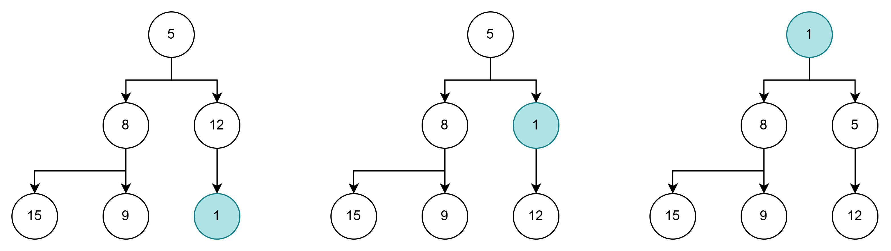
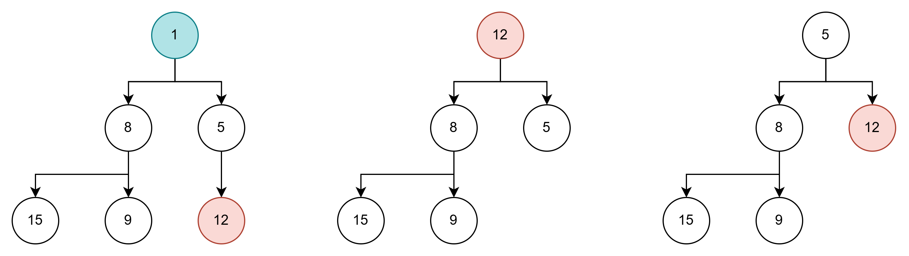
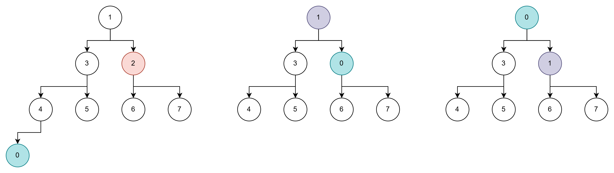

# HEAP

本项目实现一个侵入式最小堆

## 堆的特性

堆分最小堆和最大堆，一般用一个完全二叉树来表示。以最小堆为例：

- 节点值，严格小于孩子节点的值
- 左右孩子节点的值大小没有要求

通常使用数组表示一个堆，可以利用完全二叉树的特性。数组索引为i，其左孩子的为2i+1，右孩子的为2i+2

## 入堆

入堆的流程：

- 加到数组尾部，count++
- 不断向上与父节点比较交换，直到满足堆性质



## 出堆

**堆顶**出堆的流程：

- 将最后一个元素和出堆的元素替换，count--
- 替换后的元素，从该位置向下比较交换，直到满足堆性质



**堆中任意元素**出堆就需要多加判断，因为交换的堆尾可能破坏堆性质，需要上移/下移，流程如下：

- 交换堆尾元素，count--
- 比较出堆元素和堆尾
    - 堆尾较小，那么交换后可能比原来的父节点更小，需要尝试向上调整
    - 堆尾较大，那么交换后可能比原先的孩子要更大，需要尝试向下调整



## 实现细节

实现的依旧是侵入式的模板代码，`item`中存放的是在数组中的下标，从1开始

```c
// heap item定义
typedef struct{
    unsigned int index;     // 在数组中的索引
}heap_item_t;

// heap head定义
typedef struct{
    heap_item_t **array;    // 数组
    unsigned int count;     // 当前堆大小
    unsigned int size;      // 当前容量
    unsigned int min_size;  // 最小容量
    unsigned int max_size;  // 最大容量
}heap_head_t;
```

`array`使用动态分配方式，自动扩容/缩容