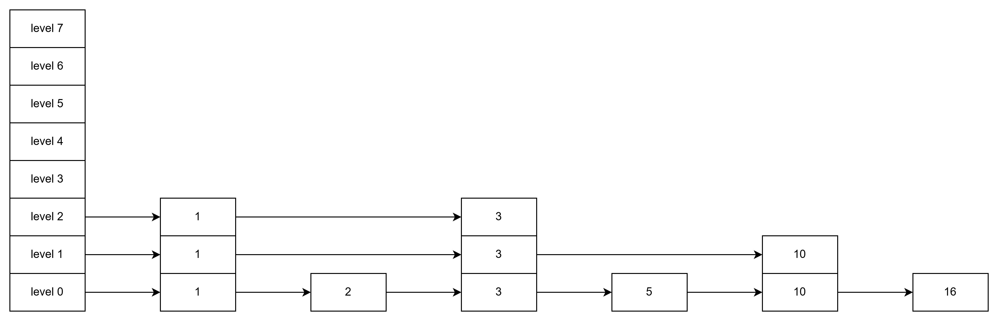
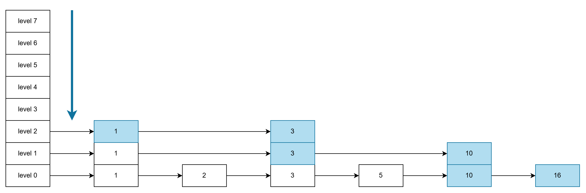

# skip list

本项目实现一个侵入式的跳表。跳表跳过添加多级索引的方式，

## 跳表

跳表的直观表示如下：



- 一个跳表分为多个层级的单调递增链表
- 一个链表节点拥有一个等级，等级越高的概率越小
- 若一个链表节点所处的层级为Level，那么他逻辑上位于0~Level层级的所有链表中

由此我们可以发现：

- level0中包含了所有的链表节点
- 高层级的链表可以看作低层级链表的缩影
- 查找节点时，效率更高
    - 例如查找16，普通单链表需要比较6次，而使用跳表从高到低，查找路径为1->3->10->16，只需要比较4次

可见跳表是一种以空间换时间的数据结构，非常适合需要有序，且频繁查找的场合

## 设计思路

跳表的结构定义如下：

```C
// 跳表item定义
typedef struct skiplist_item_s{
    struct skiplist_item_s *next[SKIPLIST_DEPTH_MAX];
}skiplist_item_t;

// 跳表head定义
typedef struct{
    skiplist_item_t head_item;      // 头节点
    unsigned int count;             // 跳表长度
}skiplist_head_t;
```

每个`item`持有一个指针数组，内含对应`level`中的下一个元素的指针

跳表支持以下接口：

- `fprefix ## _skiplist_init`：初始化
- `fprefix ## _skiplist_fini`：销毁
- `fprefix ## _skiplist_add`：插入跳表
- `fprefix ## _skiplist_del`：移出跳表
- `fprefix ## _skiplist_first`：获取表中最小值
- `fprefix ## _skiplist_last`：获取表中最大值
- `fprefix ## _skiplist_next`：获取跳表中的下一个元素，结合first可以实现遍历
- `fprefix ## _skiplist_count`：获取跳表长度
- `fprefix ## _skiplist_ceil`：获取跳表中比输入item大的最小item
- `fprefix ## _skiplist_floor`：获取跳表中比输入item小的最大item

结合ceil和floor接口，可以做到高效的范围查找。这也是跳表的优势场景

## 实现细节

### 概率生成level

为链表节点随机获取一个level值的实现如下，其中`__builtin_ctz`为内建函数，作用是统计输入值从最低位开始连续0的个数（count tailing zero），天然是几何分布的概率，这是跳表查找平均O(log n)时间复杂度的关键

```C
// 随机数转换为level，_builtin_ctz用于统计最低位开始连续0的个数，天然是2次幂的概率（不可输入0）
#define rand_to_level(r)    r == 0 ? 0 : (__builtin_ctz(r))

static attr_force_inline int _weak_random()
{
    return random();    // posix扩展
}
```

### 跳表查找

跳表的很多操作都基于查找。跳表查找的流程为：从高层开始，逐层查找，当碰到比目标值更大的值时，跳转到低层继续查找

从图来分析比较直观，如下查找16，查找路径用蓝色标识起来：



### 加入跳表

一个item加入跳表的流程：

1. 生成随机level，节点将加入[0, level]层的链表中
2. 找到level层中，比item小的元素中最大的元素prev，在level层中将item加入其后
3. 从步骤2的prev开始，往level-1层中查找比item小的元素中最大的元素prev，加入其后
4. 不断循环直到添加到level0中

### 移除跳表

item移除出跳表，需要将[0, level]层的链表中全部移除。流程如下：

1. 从高层开始查找，直到首次在level层命中item，修改其prev->next来移出item
2. 从prev开始，在level-1层继续查找，移除Item
3. 不断循环步骤2，直到level0层中移除item

