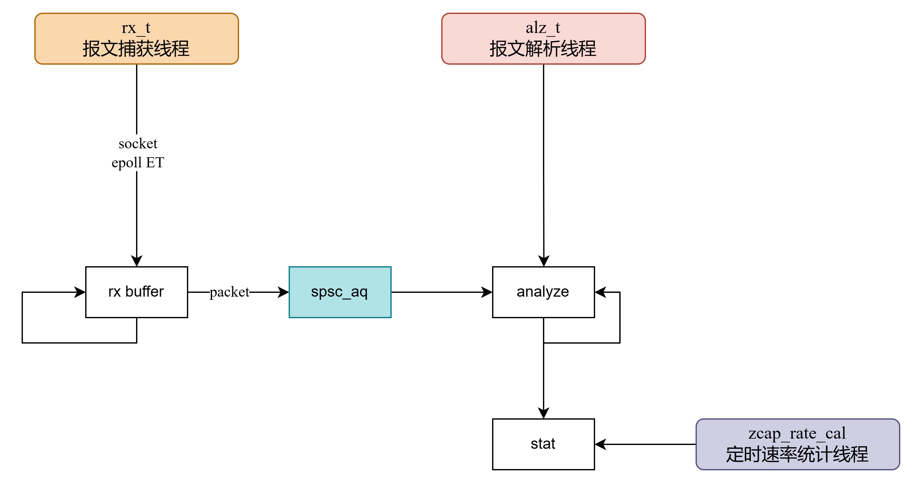

# zcap

本项目（zero-copy-cap）实现一个抓包工具，避免使用现成的libpcap库，学习zero-copy的实现

## 架构设计

传统的`recvfrom`抓包方式会因为频繁的内核态和用户态切换，内存拷贝和系统调用，成为性能瓶颈。当流量达到万兆甚至更高时，CPU 大量时间被浪费在 memcpy 上，而非报文分析

零拷贝的核心思想是通过`mmap`将内核的收包环形缓冲区直接映射到用户空间，用户态程序通过指针直接读取报文数据，全程无内存拷贝

当前整体架构如下：



- `rx_t`持续监听epoll事件，使用ET模式，当内核环形缓冲区可读时，一次性读多个block, frame，仅将报文信息放到spsc_aq中等待处理（快速）
- `alz_t`持续监听spsc_aq，将报文信息读出来分析，更新stat（耗时）
- spsc_aq中的内存来源于zcap申请的静态内存池，确保申请释放快速
- 其它外部线程定时更新stat，比如zcap_rate_cal每1s更新收包速率

## 实现细节

### 零拷贝抓包

零拷贝的核心思想是通过`mmap`将内核的收包环形缓冲区直接映射到用户空间，用户态程序通过指针直接读取报文数据，全程无内存拷贝

整体协作流程

```bash
网卡 DMA → 内核 SKB → TPACKET_V3 填充 Block → 置 TP_STATUS_USER → epoll 通知
                                                          ↑
                                              mmap 共享内存区域
                                                          ↓
用户态 _zcap_routine 读取 pkt_data (零拷贝) → memcpy 到 msg_q → 归还 TP_STATUS_KERNEL
```

#### socket设置

socket是内核与用户态通信的句柄，后续mmap映射ring buffer的基础。

首先创建socket，`AF_PACKET`指定协议为底层数据包接口，绕过TCP/IP协议栈，直接对网卡；`SOCK_RAW`标识获取完整的原始帧；`ETH_P_ALL`标识捕获所有协议类型报文，需要`htons`

```C
// 创建原始套接字，用于捕获所有网络报文
captor->sock_fd = socket(AF_PACKET, SOCK_RAW, htons(ETH_P_ALL));
```

然后获取网卡索引，将socket绑定到指定的网卡上

```C
// 获取接口对应的索引
strncpy(ifr.ifr_name, captor->if_name, IFNAMSIZ-1);
if(-1 == ioctl(captor->sock_fd, SIOCGIFINDEX, &ifr))
{
    dbg_error("ioctl get ifindex fail");
    goto clean_up;
}
captor->if_index = ifr.ifr_ifindex;

// socket绑定到接口
addr.sll_family = AF_PACKET;
addr.sll_protocol = htons(ETH_P_ALL);
addr.sll_ifindex = captor->if_index;
if(-1 == bind(captor->sock_fd, (struct sockaddr*)&addr, sizeof(addr)))
{
    dbg_error("bind socket to if fail");
    goto clean_up;
}
```

最后开启混杂模式，默认情况下网卡只会获取dmac本机、广播、组播帧给内核，开启混杂模式后，网卡会将流经的所有帧上送到内核

```C
// 接口开启混杂模式
mr.mr_ifindex = captor->if_index;
mr.mr_type = PACKET_MR_PROMISC;
if(-1 == setsockopt(captor->sock_fd, SOL_PACKET, PACKET_ADD_MEMBERSHIP, &mr, sizeof(mr)))
    dbg_error("set promisc module fail, continue");
```

#### ring rx buffer设置

Linux内核提供了三代`PACKET_MMAP`接口。V3的Ring Buffer由多个固定大小的Block组成，每个Block内部包含若干变长的Frame（报文）

```C
┌─────────────────────── Ring Buffer (mmap) ───────────────────────┐
│ Block 0                │ Block 1                │ Block N        │
│ ┌─────┬─────┬─────┐   │ ┌─────┬─────┬─────┐   │                │
│ │Frm0 │Frm1 │Frm2 │   │ │Frm0 │Frm1 │ ... │   │     ...        │
│ └─────┴─────┴─────┘   │ └─────┴─────┴─────┘   │                │
│ [Block Header]         │ [Block Header]         │                │
└────────────────────────┴────────────────────────┴────────────────┘
```

- Block Header (tpacket_block_desc)：记录该 Block 中报文的数量、第一个报文的偏移量、以及所有权状态标志。
- Frame (tpacket3_hdr)：包含报文元数据（长度、时间戳、MAC 偏移等），报文数据紧跟其后。
- 所有权协议：内核写入完毕后置 TP_STATUS_USER；用户态消费完毕后必须手动置回 TP_STATUS_KERNEL，否则内核无法复用该 Block，最终导致丢包。

TPACKET_V3 对参数有硬性整除约束，设置如下：

```C
// 一个块的大小，mmap要求页对齐，此处设置页*1024
#define BLOCK_SIZE      (sysconf(_SC_PAGESIZE)*1024)
// 块的数量，一共64*4MB=256MB映射
#define BLOCK_NR        (64)
// 帧大小，2KB，足够满足普通以太网报文
#define FRAME_SIZE      (2048)
// 帧数量
#define FRAME_NR        (BLOCK_SIZE*BLOCK_NR/FRAME_SIZE)
struct tpacket_req3 req = {
        .tp_block_size = BLOCK_SIZE,
        .tp_block_nr = BLOCK_NR,
        .tp_frame_size = FRAME_SIZE,
        .tp_frame_nr = FRAME_NR,
        .tp_retire_blk_tov = 100,   // 超时100ms，避免延迟过大
    };
```

`tp_retire_blk_tov`参数，是为了保证低速流量也能触发事件，否则可能出现block没有填满，未及时通知。指定参数后，100ms即使没有填充满block也会触发事件

首先设置ring参数，为此前创建的socket申请环形缓冲区

```C
// 设置环形缓冲区参数
int version = TPACKET_V3;
setsockopt(captor->sock_fd, SOL_PACKET, PACKET_VERSION, &version, sizeof(version));
if(-1 == setsockopt(captor->sock_fd, SOL_PACKET, PACKET_RX_RING, &req, sizeof(req)))
{
    perror("fail");
    dbg_error("set rx ring fail, sock_fd %d", captor->sock_fd);
    goto clean_up;
}
```

然后将环形缓冲区映射到用户空间

```C
// 从内核映射
captor->ring_len = BLOCK_SIZE*BLOCK_NR;
captor->ring_buffer = mmap(NULL, captor->ring_len, prot, map_flag, captor->sock_fd, 0);
if(MAP_FAILED == captor->ring_buffer)
{
    dbg_error("mmap ring buffer fail");
    goto clean_up;
}
```

#### IO机制

在`_zcap_routine`，我们使用epoll+ET的模式来监听socket，当网卡提交报文给内核时，socket收到通知，我们获知这个事件，直接去映射好的缓冲区拿报文即可。

这里epoll必须使用ET模式，使用LT的话，由于这块ring buffer几乎一直都是存在`TP_STATUS_USER`状态的block，epoll几乎变成了轮询。